基于ssm的企业OA（考勤）管理系统

源码下载:http://www.manoncode.cn/details?id=11

CSDN博客地址：https://blog.csdn.net/mataodehtml/article/details/113694848

技术：ssm+jsp+layui 
功能：登陆，部门管理，菜单管理，仓库管理，公告管理，雇员管理，考勤打卡，请假审批，权限管理，
打卡记录，出入库管理 
系统登陆角色和菜单权限可以灵活配置

最高权限登陆：用户名：100001   密码：111111

其他登陆默认密码都是：000000

运行时注意：idea应用项目名必须改成：OA_Manager

登陆人员所在表为：sys_employee 其中的ROLE_ID就是对应的角色

运行截图：

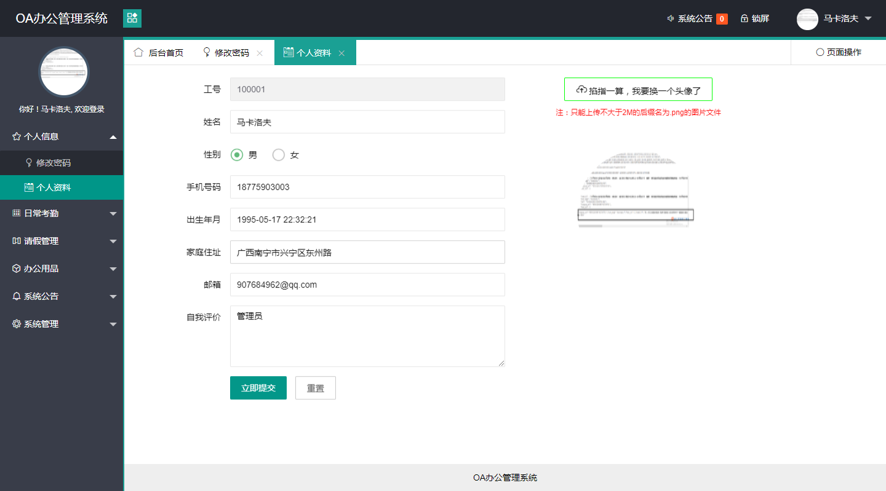

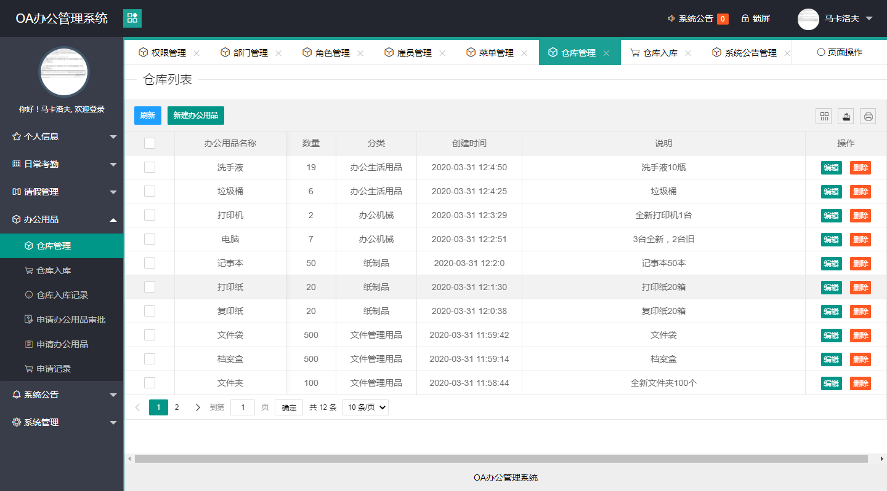

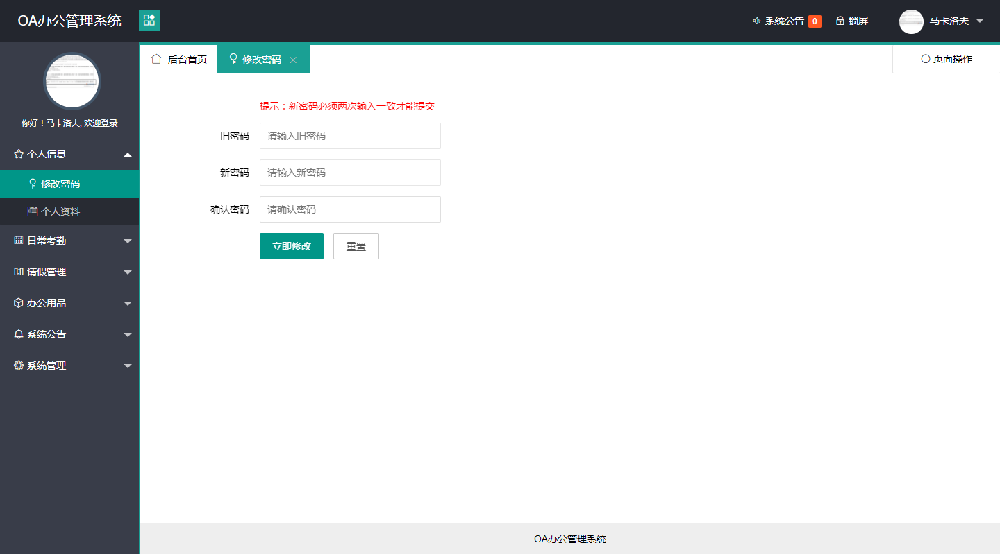

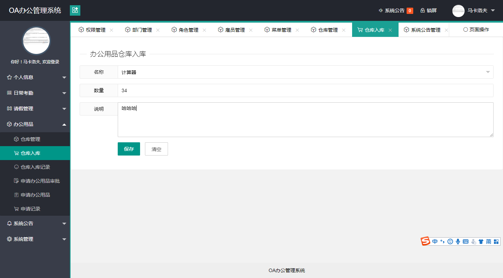

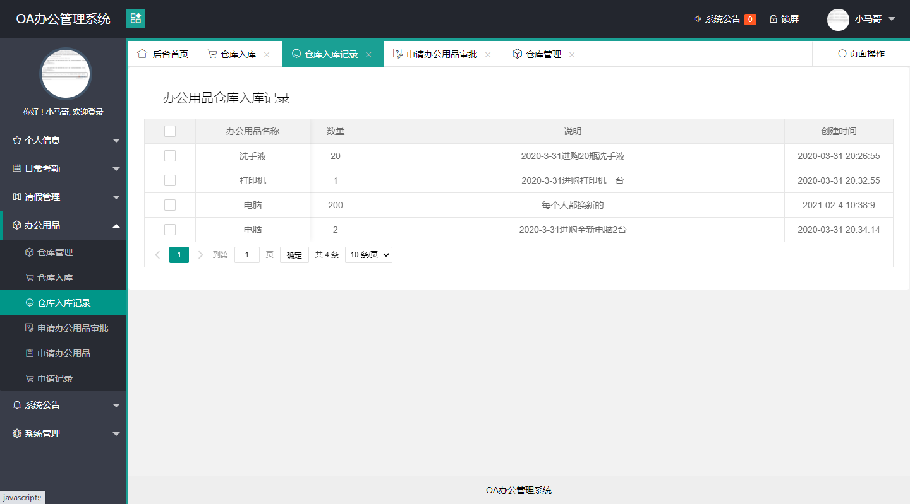

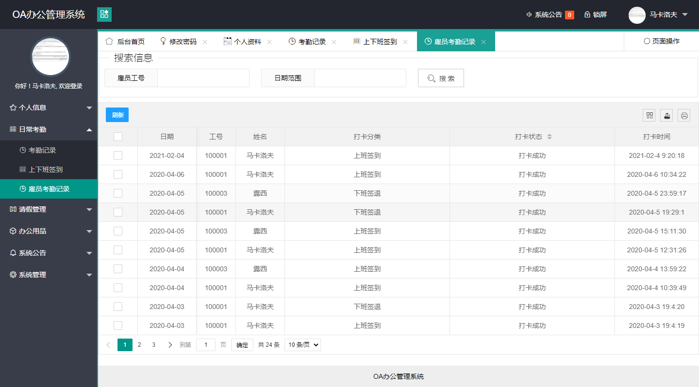

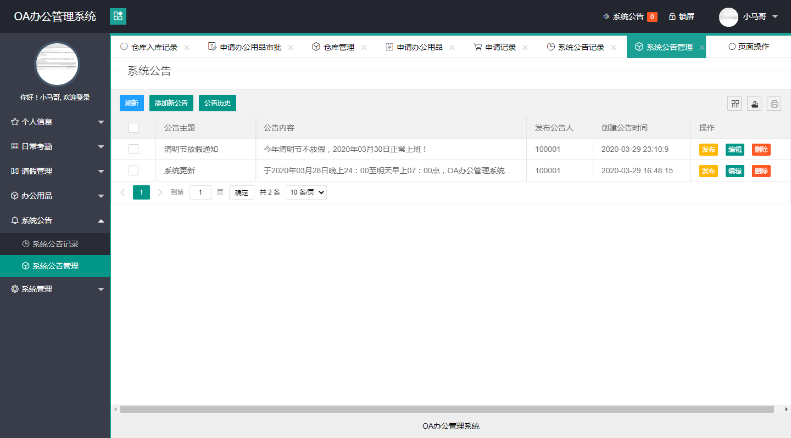

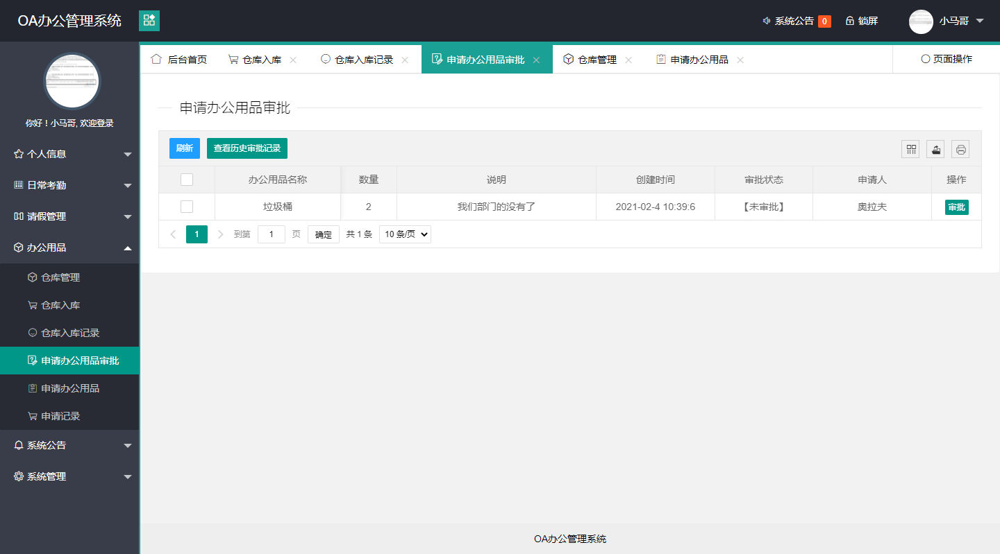

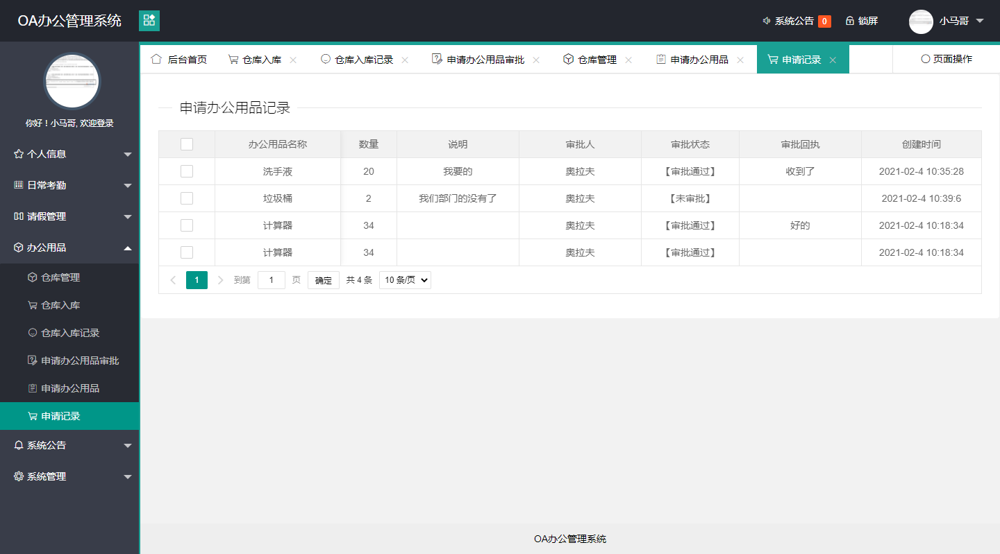

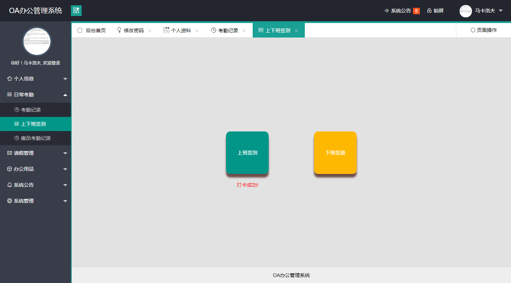

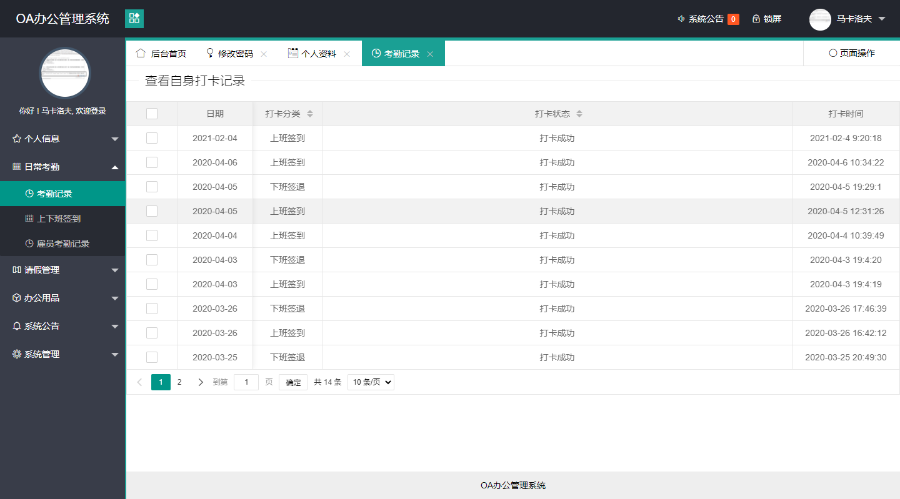

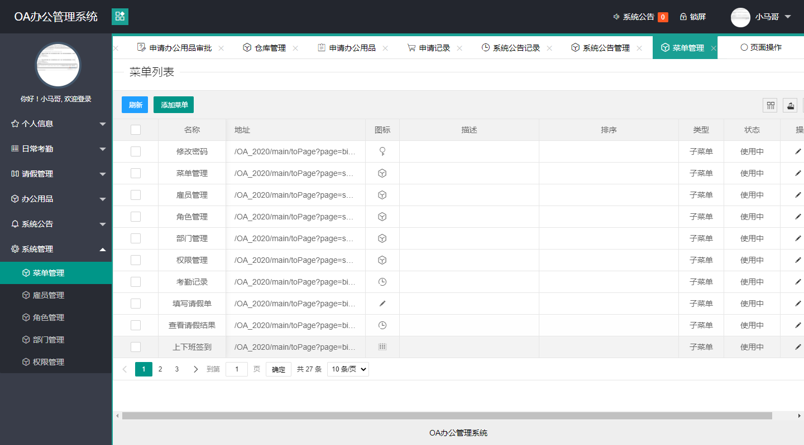

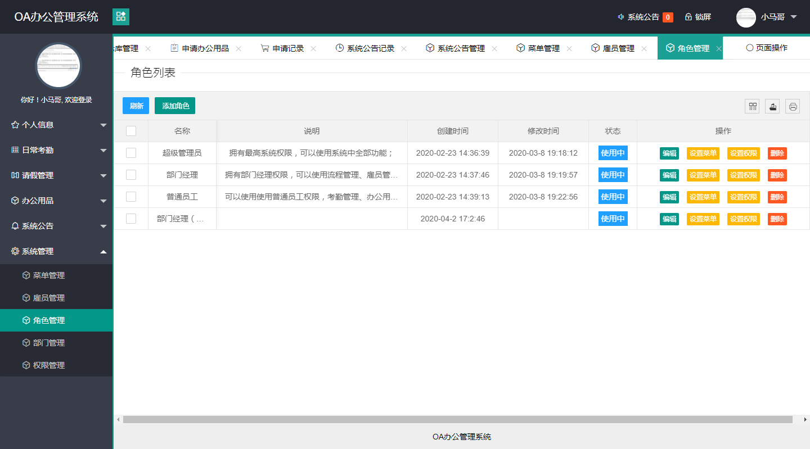

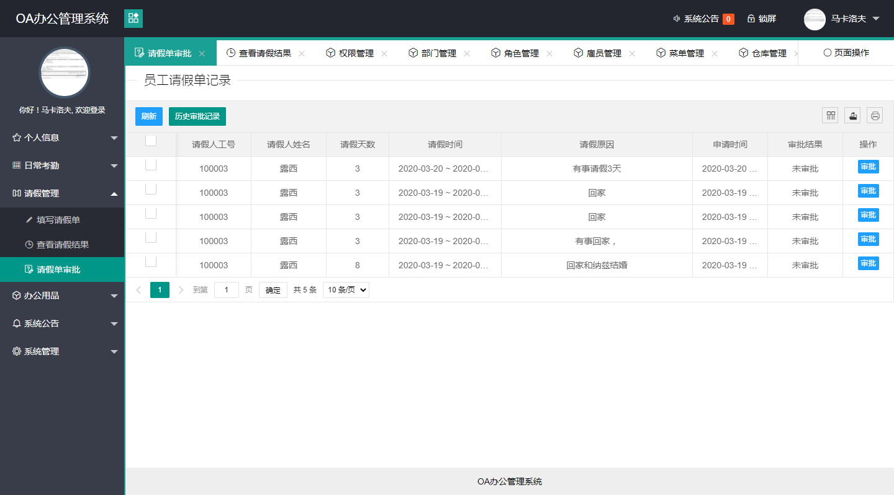

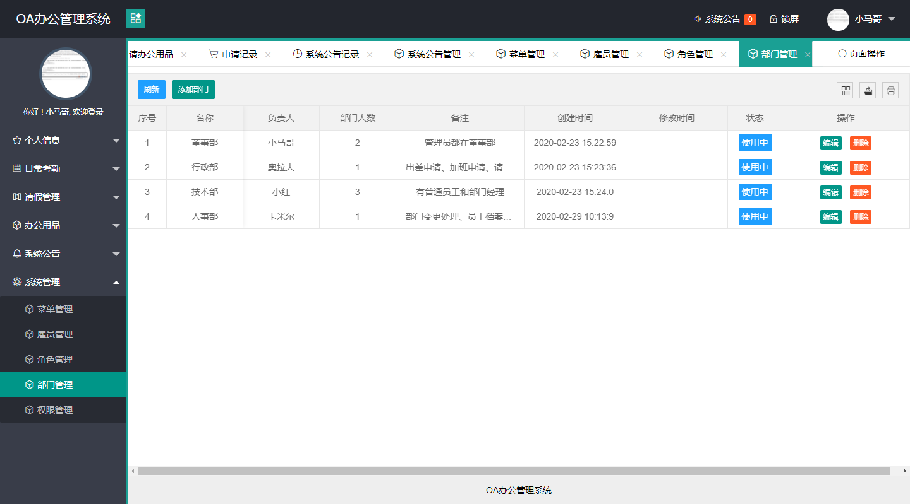

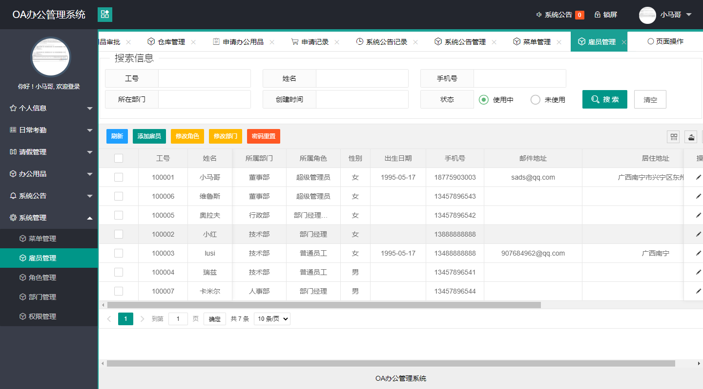

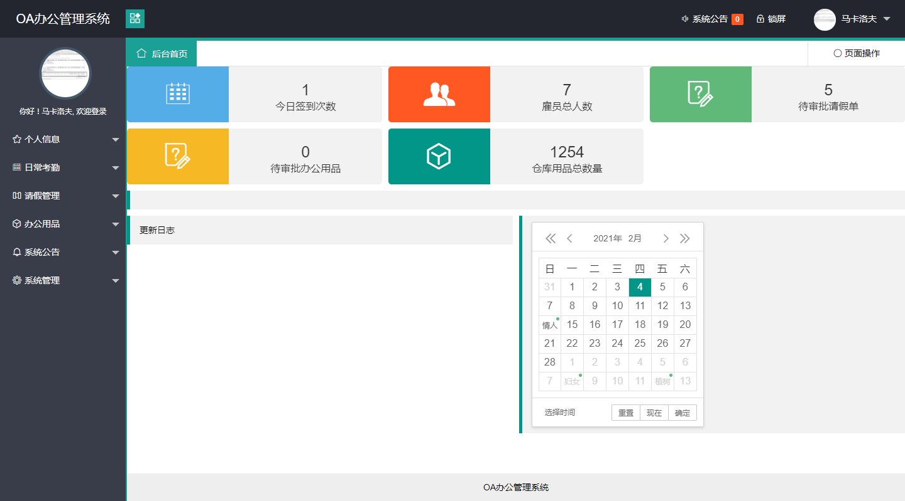
